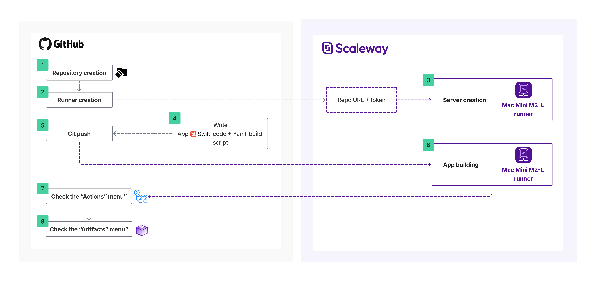

# Apple Github runner



```shell
# Download the artifact with FIREFOX (not Safari because it automatically unzip files)
cd Downloads
unzip DemoRunner_App_MacOS.zip && unzip DemoRunner_macOS.zip && mkdir DemoRunner-MacOS && mv Contents DemoRunner-MacOS/ && mv DemoRunner-MacOS DemoRunner-MacOS.app && chmod +x DemoRunner-MacOS.app
```


```shell
unzip DemoRunner_App_iOS_Sim.zip && unzip DemoRunner_iOS_Simulator.zip && mkdir DemoRunner.app && mv Assets.car DemoRunner Info.plist PkgInfo DemoRunner.app/ && chmod +x DemoRunner.app
```
